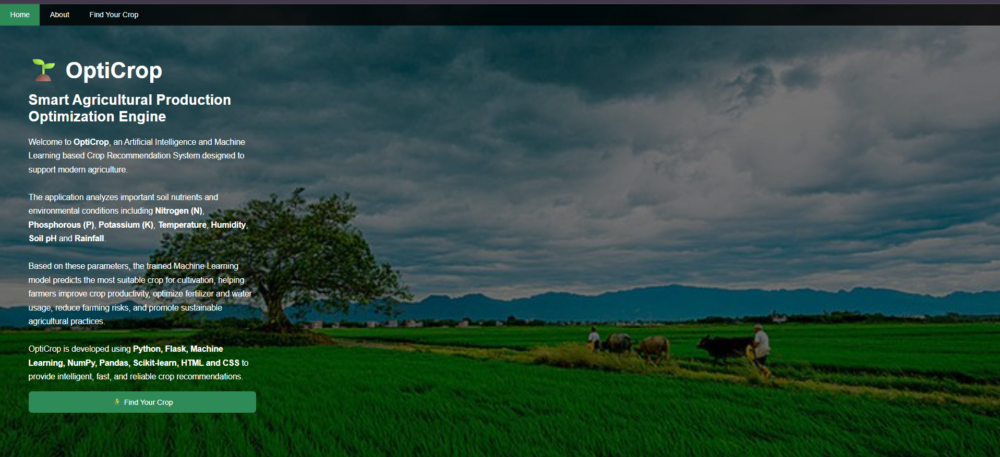
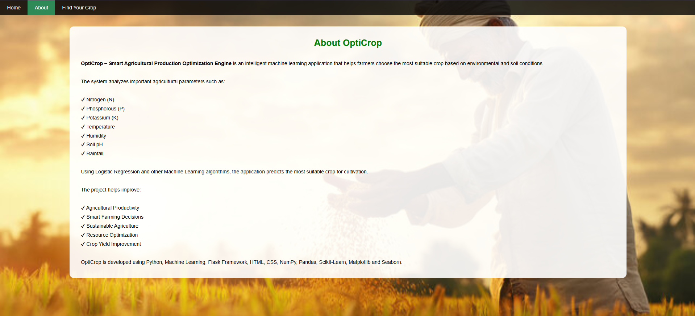
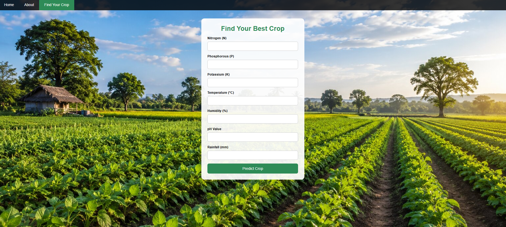
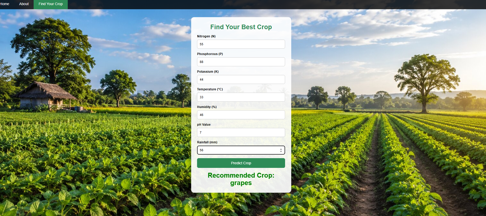
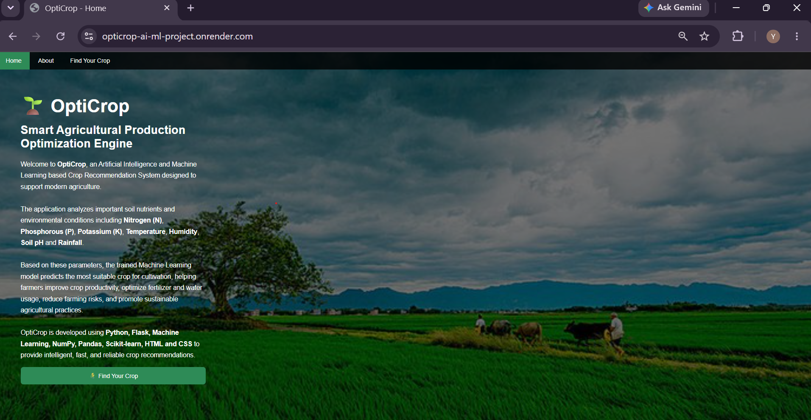

# 🌾 OptiCrop – Smart Agricultural Crop Recommendation System

## 📌 Project Description

OptiCrop is a Machine Learning-based web application that recommends the most suitable crop based on soil nutrients and environmental conditions. The system helps farmers make informed agricultural decisions by analyzing Nitrogen (N), Phosphorous (P), Potassium (K), Temperature, Humidity, pH, and Rainfall values.

The project is developed using Python, Flask, Scikit-learn, HTML, and CSS to provide intelligent crop recommendations for improved agricultural productivity.

---

## 🌐 Live Demo

🚀 **Live Website:**  
https://opticrop-ai-ml-project.onrender.com

---

## 🎥 Project Demonstration

A complete demonstration of the OptiCrop project, including the project overview and application workflow, is available at the link below.

📹 **Demo Video:**  
https://drive.google.com/file/d/1mKiV1LAl5O9kX9mPuoIGz9JKwN9Qjc9O/view?usp=sharing

---

💻 **GitHub Repository:**  
https://github.com/sk34567/OptiCrop-AI-ML-Project

---

## 🚀 Features

- Machine Learning-based crop prediction
- User-friendly Flask web application
- Attractive Home, About, and Crop Recommendation pages
- Predicts the best crop using environmental conditions
- Fast and accurate crop recommendations
- Simple and responsive interface

---

## 🛠️ Technologies Used

- Python
- Flask
- Scikit-learn
- Pandas
- NumPy
- HTML5
- CSS3
- Machine Learning
- Gunicorn
- Render (Deployment)

---

## 📂 Project Structure

```text
OptiCrop-AI-ML-Project
│
├── Documentation
│   └── OptiCrop_Project_Documentation.pdf
│
├── Screenshots
│   ├── 01_Home_Page.png
│   ├── 02_About_Page.png
│   ├── 03_Find_Your_Crop_Page.png
│   ├── 04_Crop_Prediction_Result.png
│   └── 05_Live_Demo.png
│
├── Source Code
│   ├── app.py
│   ├── analysis.py
│   ├── model.pkl
│   ├── Crop_recommendation.csv
│   ├── requirements.txt
│   ├── Procfile
│   ├── templates
│   └── static
│
├── README.md
└── .gitignore
```

---

## ⚙️ How to Run the Project Locally

### 1. Clone the repository

```bash
git clone https://github.com/sk34567/OptiCrop-AI-ML-Project.git
```

### 2. Navigate to the project directory

```bash
cd OptiCrop-AI-ML-Project
```

### 3. Open the Source Code folder

```bash
cd "Source Code"
```

### 4. Install the required dependencies

```bash
pip install -r requirements.txt
```

### 5. Run the Flask application

```bash
python app.py
```

### 6. Open your browser

For local execution:

```text
http://127.0.0.1:5000
```

Or use the deployed application:

```text
https://opticrop-ai-ml-project.onrender.com
```

---

## 🤖 Machine Learning Model

**Algorithm Used:** Logistic Regression

**Dataset:** Crop Recommendation Dataset

**Model Accuracy:** **98.30%**

### Input Parameters

- Nitrogen (N)
- Phosphorous (P)
- Potassium (K)
- Temperature
- Humidity
- Soil pH
- Rainfall

### Output

- Recommended Crop

---

## 📸 Screenshots

### 🏠 Home Page



### ℹ️ About Page



### 🌱 Find Your Crop Page



### ✅ Prediction Result



### 🌐 Live Demo



---

## 📄 Project Documentation

The complete project documentation is available in the **Documentation** folder.

---

## 👥 Team Members

| S.No | Name | Role |
|------|-------------------------------|-----------------------------------------------------------|
| 1 | Aki Harsha Vardhini | Machine Learning Developer & Flask Application Developer (Team Lead) |
| 2 | Yamparala Sravani | Machine Learning Developer & Flask Application Developer (Team Member) |
| 3 | Venkata Pavana Lakshmi Santa Javvaji | Machine Learning Developer & Flask Application Developer (Team Member) |
| 4 | Shaik Yasin | Machine Learning Developer & Flask Application Developer (Team Member) |
| 5 | Kosuru Lokesh | Machine Learning Developer & Flask Application Developer (Team Member) |

---

## 🔮 Future Enhancements

- Weather API Integration
- Fertilizer Recommendation System
- Soil Health Analysis
- Multi-language Support
- Mobile Application
- User Authentication
- Cloud Database Integration

---


